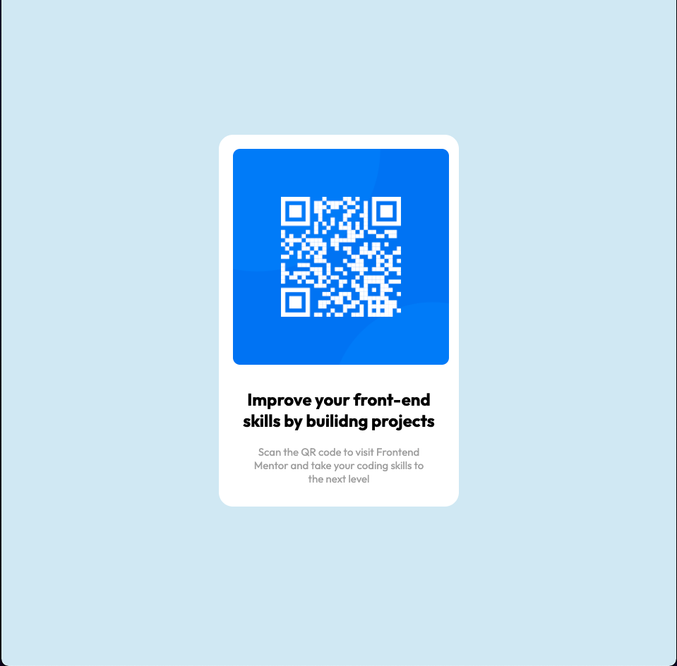

## Table of contents

- [Overview](#overview)
  - [Screenshot](#screenshot)
  - [Links](#links)
- [My process](#my-process)
  - [Built with](#built-with)
- [Author](#author)

**Note: Delete this note and update the table of contents based on what sections you keep.**

## Overview

### Screenshot


- desktop screen shot 
- mobile screen shot 


### Links

- Solution URL: [Add solution URL here](https://your-solution-url.com)

## My process

  I started by clearing the default margin and padding. 

  ```CSS
  *{
    margin: 0;
    padding: 0;
    box-sizing: border-box;
  }
  ```

  Then I did the first div that would contain all of my content (content-container) and also styling it to fit mobile first view. I then went and put in the background color for the body.
  ```CSS
  body{
    background-color: rgb(216, 235, 245);
  }
```

Next I created the elements inside the html file and styled them. 

Finally I imported the font family and added it to the h2,p elements. 

### Built with

- Semantic HTML5 markup
- CSS custom properties
- Flexbox
- CSS Grid
- Mobile-first workflow


## Author

- Website - [Terrell Tinsley](https://ttinsley.dev/)
- Frontend Mentor - [@TRellTins](https://www.frontendmentor.io/profile/TRellTins
- Twitter - [@TRellTinsley](https://www.twitter.com/trelltinsley)
